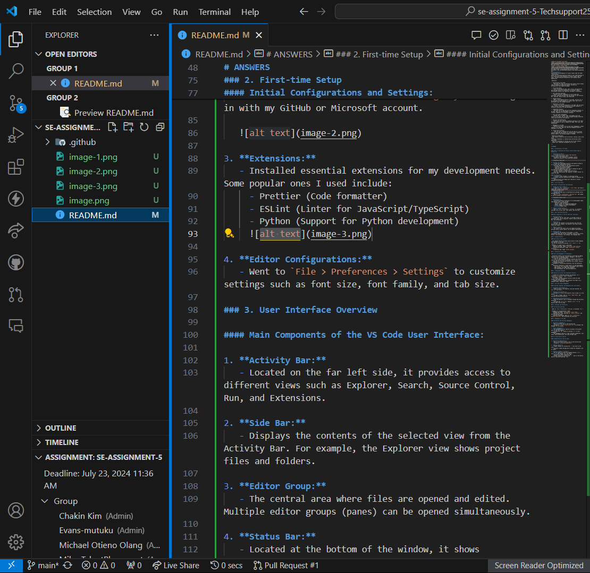

# SE-Assignment-5
Installation and Navigation of Visual Studio Code (VS Code)
 Instructions:
Answer the following questions based on your understanding of the installation and navigation of Visual Studio Code (VS Code). Provide detailed explanations and examples where appropriate.

 Questions:

1. Installation of VS Code:
   - Describe the steps to download and install Visual Studio Code on Windows 11 operating system. Include any prerequisites that might be needed.

2. First-time Setup:
   - After installing VS Code, what initial configurations and settings should be adjusted for an optimal coding environment? Mention any important settings or extensions.

3. User Interface Overview:
   - Explain the main components of the VS Code user interface. Identify and describe the purpose of the Activity Bar, Side Bar, Editor Group, and Status Bar.

4. Command Palette:
   - What is the Command Palette in VS Code, and how can it be accessed? Provide examples of common tasks that can be performed using the Command Palette.

5. Extensions in VS Code:
   - Discuss the role of extensions in VS Code. How can users find, install, and manage extensions? Provide examples of essential extensions for web development.

6. Integrated Terminal:
   - Describe how to open and use the integrated terminal in VS Code. What are the advantages of using the integrated terminal compared to an external terminal?

7. File and Folder Management:
   - Explain how to create, open, and manage files and folders in VS Code. How can users navigate between different files and directories efficiently?

8. Settings and Preferences:
   - Where can users find and customize settings in VS Code? Provide examples of how to change the theme, font size, and keybindings.

9. Debugging in VS Code:
   - Outline the steps to set up and start debugging a simple program in VS Code. What are some key debugging features available in VS Code?

10. Using Source Control:
    - How can users integrate Git with VS Code for version control? Describe the process of initializing a repository, making commits, and pushing changes to GitHub.

 Submission Guidelines:
- Your answers should be well-structured, concise, and to the point.
- Provide screenshots or step-by-step instructions where applicable.
- Cite any references or sources you use in your answers.
- Submit your completed assignment by 1st July 

---

# ANSWERS

### 1. Installation of VS Code

#### Steps to Download and Install Visual Studio Code on Windows 11:

1. **Download VS Code:**
   - I visited the [Visual Studio Code website](https://code.visualstudio.com/).
   - Clicked on the "Download for Windows" button.
   - Saved the installer to my preferred location.

   

2. **Install VS Code:**
   - Located the downloaded installer and double-clicked on it to start the installation process.
   - Followed the prompts in the installation wizard:
     - Accepted the license agreement.
     - Chose the destination folder.
     - Selected additional tasks such as adding VS Code to the PATH and creating a desktop icon.
   - Clicked "Install" to begin the installation.
   - Once the installation was complete, clicked "Finish" to launch VS Code.

#### Prerequisites:
   - I ensured I had a Windows 11 operating system.
   - A stable internet connection was needed to download the installer.
   - Administrative privileges were required to install software on my system.

### 2. First-time Setup

#### Initial Configurations and Settings:

1. **Theme and Color Scheme:**
   - I went to `File > Preferences > Color Theme` and chose a theme that suited my preference.

2. **Settings Sync:**
   - Enabled Settings Sync to synchronize my settings across multiple devices.
   - Went to `File > Preferences > Settings Sync` and signed in with my GitHub or Microsoft account.

   

3. **Extensions:**
   - Installed essential extensions for my development needs. Some popular ones I used include:
     - Prettier (Code formatter)
     - ESLint (Linter for JavaScript/TypeScript)
     - Python (Support for Python development)
     

4. **Editor Configurations:**
   - Went to `File > Preferences > Settings` to customize settings such as font size, font family, and tab size.

### 3. User Interface Overview

#### Main Components of the VS Code User Interface:

1. **Activity Bar:**
   - Located on the far left side, it provides access to different views such as Explorer, Search, Source Control, Run, and Extensions.

2. **Side Bar:**
   - Displays the contents of the selected view from the Activity Bar. For example, the Explorer view shows project files and folders.

3. **Editor Group:**
   - The central area where files are opened and edited. Multiple editor groups (panes) can be opened simultaneously.

4. **Status Bar:**
   - Located at the bottom of the window, it shows information about the current workspace, such as the current branch, file encoding, line endings, and language mode.

### 4. Command Palette

#### Description and Access:

- The Command Palette provides quick access to many commands and features in VS Code.
- It can be accessed by pressing `Ctrl + Shift + P` (or `F1`).
- Examples of common tasks I performed:
  - Opening settings: Typed `Preferences: Open Settings`.
  - Installing extensions: Typed `Extensions: Install Extensions`.
  - Formatting code: Typed `Format Document`.

### 5. Extensions in VS Code

#### Role and Management of Extensions:

- Extensions enhance the functionality of VS Code by adding features such as language support, debuggers, and tools.
- To find and install extensions:
  - I went to the Extensions view by clicking the Extensions icon in the Activity Bar or pressing `Ctrl + Shift + X`.
  - Searched for the desired extension and clicked "Install".
- To manage extensions:
  - Disabled or uninstalled extensions from the Extensions view.
  - Essential extensions I found useful for web development:
    - Live Server (for launching a development local server)
    - HTML Snippets (for HTML code snippets)
    - CSS IntelliSense (for CSS autocompletion)

### 6. Integrated Terminal

#### Opening and Using the Integrated Terminal:

- I opened the integrated terminal by pressing `Ctrl + ` ` (backtick) or Ctrl + j or going to `View > Terminal`.
- Advantages I found:
  - It allows running commands directly within VS Code without switching context.
  - Supports multiple terminal instances and types (e.g., Command Prompt, PowerShell, Bash).

### 7. File and Folder Management

#### Creating, Opening, and Managing Files and Folders:

1. **Creating Files/Folders:**
   - Right-clicked in the Explorer view and selected `New File` or `New Folder`.

2. **Opening Files/Folders:**
   - Clicked on a file in the Explorer view to open it in the editor.
   - To open a folder, went to `File > Open Folder` and selected the desired directory.

3. **Navigating Files/Directories:**
   - Used the Explorer view to navigate through the directory structure.
   - Utilized the `Go to File` feature (`Ctrl + P`) to quickly open files by name.

### 8. Settings and Preferences

#### Customizing Settings:

- Went to `File > Preferences > Settings` or pressed `Ctrl + ,`.
- Examples of customizations I made:
  - Changed the theme: `Preferences > Color Theme`.
  - Adjusted font size: Searched for `editor.fontSize` and set the desired value.
  - Modified keybindings: Went to `File > Preferences > Keyboard Shortcuts` and customized the shortcuts.

### 9. Debugging in VS Code

#### Setting Up and Starting Debugging:

1. **Configure Debugger:**
   - Went to the Run view in the Activity Bar.
   - Clicked on `create a launch.json file` to configure the debugger for my project.

2. **Start Debugging:**
   - Set breakpoints in my code by clicking in the gutter next to the line numbers.
   - Clicked the `Run` button or pressed `F5` to start debugging.
   - Key debugging features I used: Variable inspection, call stack, watch expressions, and step through code.

### 10. Using Source Control

#### Integrating Git with VS Code:

1. **Initialize Repository:**
   - Went to the Source Control view in the Activity Bar.
   - Clicked on `Initialize Repository`.

2. **Making Commits:**
   - Staged changes by clicking the `+` icon next to the file.
   - Entered a commit message and clicked the checkmark icon to commit.

3. **Pushing Changes to GitHub:**
   - Set up remote by using the Command Palette (`Ctrl + Shift + P`) and typing `Git: Add Remote`.
   - Entered the remote repository URL.
   - Pushed changes by clicking the `...` menu in the Source Control view and selecting `Push`.